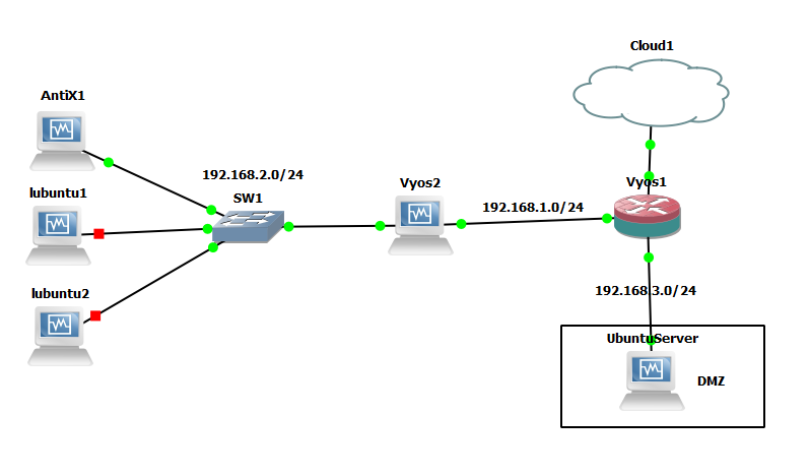

# Proxy Firewall con Vyos

Este proyecto busca realizar la implementación de diferentes sistemas operativos, tanto para uso como dispositivos de borde, como para uso de usuarios finales, se pretende implementar un toplogia que haga uso del Firewall

## Sistemas usados 🚀
Para la simulación de nuestra topología, se implementaron los siguientes sistemas operativos en el programa virtualbox:

###  Vyos

VyOS es un sistema operativo de red basado en Linux que proporciona enrutamiento de red basado en software, firewall y funcionalidad VPN. En esta oportunidad lo utilizaremos como enrutador y como firewall para una red, además se establecerá un webproxy para limitar los contenidos que pueden consultar los usuarios finales.

### Antix

Es una distribución de Linux construida directamente sobre Debian. Es comparativamente liviano y adecuado para computadoras más antiguas, al mismo tiempo que proporciona kernel y aplicaciones de vanguardia, así como actualizaciones y adiciones a través del sistema de paquetes apt-get y repositorios compatibles con Debian.

### Lubuntu

Es una distribución Linux ligera, basada en Ubuntu, que emplea el entorno de escritorio LXQt en lugar del entorno GNOME de Ubuntu.

## Implementacion 🖇️
En esta ocasión pretendemos hacer una implementación de:
* Webproxy
* Firewall
* DMZ
* Acceso SSH
* Servidor WEB

Para ello utilizamos la siguiente topologia basica:

  

Teniendo en cuenta esta topología procedemos a realizar la configuración del VyOS1 que será el encargado además del firewall y de la conexión a internet.

Para poder probar el funcionamiento del webproxy se requiere la conexión a internet en este caso, se habilita una red compartida con un adaptador de bucle invertido el cual llamaremos  loopback,  se habilita en la topología de GNS3,  después se coloca una primera VM con VyOS1, que maneja la conexión a internet y que llevará la regla nat  que comunicara la red LAN con la WAN.   

Para la conexión WAN se configura DHCP y se asigna una red a las demás interfaces del dispositivo, luego hacemos un enrutamiento estático para que se pueda dar la comunicación.
El VyOS2 será el encargado de manejar el webproxy que se aplica a la red 192.168.2.0 limitando el contenido que se puede navegar en los computadores de dicha red, también se configura un DHCP para generar los dispositivos de esta red.

En el apartado de la DMZ configuramos un servidor web permitiendo las conexiones tanto desde la red interna como de la externa , mientras que las conexiones que parten de la DMZ solo puedan salir a la red interna.

La configuración completa de estos dispositivos se puede encontrar en [comandosConsola](comandosConsola)

## Firewall

En línea de comandos podemos aceptar, soltar y rechazar paquetes de diferentes protocolos, además de especificar el tipo de tráfico que se requiere gestionar, teniendo tráfico LOCAL, IN y OUT; los cuales especifican el tráfico dentro del sistema VyOS, tráfico entrante y saliente.

## Autores ✒️

* **Nicolas Mendigaño** 
* **Esteban Ruiz** 
* **Jeison Jara** 

## Construido con 🛠️

* [Vyos](https://www.vyos.io//)
* [VM Virtualbox](https://www.virtualbox.org/)
* [GNS3](https://www.gns3.com/)

